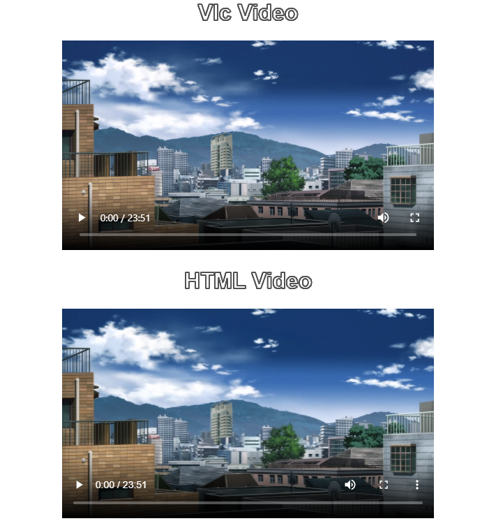

# vue-vlc-player
VLC player component for [vue-electron-builder](https://github.com/nklayman/vue-cli-plugin-electron-builder).
This component was made to work as similarly to `<video>` as possible, when `controls` are enabled they will look similar to Chrome's `<video controls>`

### Example usage: 
```html
<vlc-video height="300" controls dark src="http://localhost:3000/file.mkv"/>
```

### Screenshot of `<vlc-player controls>` and `<video controls>`



## Extra features (That aren't in `<video>`)
* Any codec supported in VLC is supported in this player.

* Volume range is `[0,2]` with `2` being 200% volume, `1` is default 100% volume
* Custom props
  * `cover-poster` determines if the poster should cover the player or be contained within the player
  * `enable-keys` Optional key binds 
  * `enable-scroll`Optional scroll to change volume 
  * `enable-status-text` Optional status icons top right like VLC has (showing when volume changed, seek time, play/pause, etc.) 
  * `enable-context-menu`Optional context menu allowing user control over video/audio/subtitle track, and some other VLC features 
  * `dark` enables dark theme (only for the context menu icons)

## Biggest differences with `<video>`
* This is a Vue component
* libvlc doesn't expose what sections are buffered as far as I know, so the `.buffered` member returns that everything is buffered.
* `.canPlayType(mediaType)` always returns `'probably'`
* No streams (`srcObject` or `captureStream`)
* Subtitles are handled by VLC, add a subtitles track by calling `.addTextTrack(filepath)` on the VlcVideo VueComponent
* The CSS properties `height` and `width` don't affect this player like they do a HTMLVideoElement. `width` and `height` on the element itself do work, for example: `<vlc-video width="500" src="http://example.com/file.mkv">`
* Picture-in-picture is not supported
* Only `'nofullscreen'` of `.controlsList` is supported, this disables the fullscreen button when controls or context menu is enabled.

## Usage notes
* Actual component is `src/components/VlcVideo.vue`
* Dependencies are specified in `package.json` (notably `RuurdBijlsma/wrap-chimera` and `RuurdBijlsma/wcjs-prebuilt`)
* Electron and Vue are required

Required configuration for `vue.config.js`:
```js
module.exports = {
    pluginOptions: {
        electronBuilder: {
            externals: ['wcjs-prebuilt'],
            nodeIntegration: true,
        }
    },
}
```